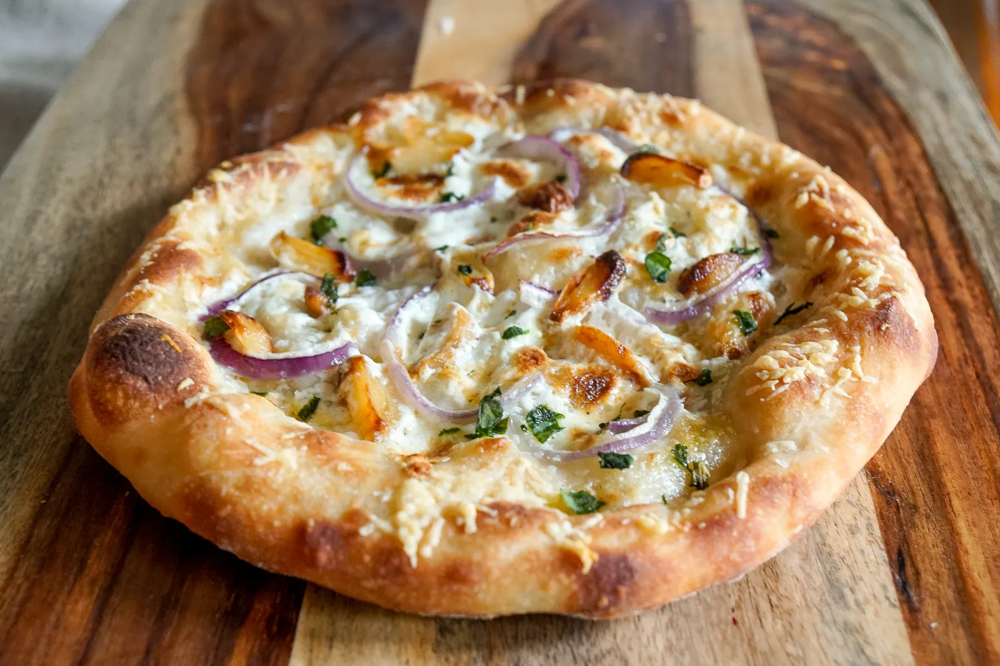

# Markdown
Skills

## Pizza Recept

### Voorbereiding 
- 50 mins

### Kook tijd
- 10 mins

### Ingredienten 

- Head of garlic
- Red onion
- Cup Whip cream
- Cup Mozzarella cheese
- Handful of shredded parmesan cheese
- Dried basil or oregano
- Olive oil

### Bereidings wijze 

Wanneer de oven voorverwarmt, snijdt u de bovenkant van de knoflookkop af, sprenkelt u olijfolie op blootgestelde teentjes, wikkelt u deze in folie en plaatst u deze ongeveer 40 minuten in de oven. Tot de knoflook lekker zacht is.
Terwijl knoflook aan het roosteren is, snijd je je rode ui dun in plakjes, versnipper je mozzarellakaas en haal je de olijfolie eruit.
Zodra knoflook gaar is, verwijder je knoflookteentjes van het hoofd en leg je het naast andere toppings. Misschien wil je de grote kruidnagels doormidden snijden.
Wanneer de oven 450 graden heeft bereikt, klop je de slagroom met een elektrische klopper totdat je pieken begint te zien ontstaan. Neem een korte pauze, maar je komt terug zodra pizza in de oven is.
Vorm pizzadeeg in schijf. Borstel olijfolie lichtjes rond de omtrek van de korst en zet ongeveer 2 minuten in de oven. Terwijl het deeg in de oven staat, blijf je de room kloppen totdat er mooie pieken ontstaan.
Haal pizza uit de oven en plaats een paar lepels slagroom rond pizza met behulp van de achterkant van de lepel om rond te spreiden, waardoor er ongeveer 1 inch overblijft voor de korst.
Besprenkel een beetje olijfolie.
Besmeerd geraspte mozzarella kaas
Voeg geroosterde knoflook en in plakjes gesneden rode ui toe
Neem een handvol geraspte Parmezaanse kaas en strooi er korst over.
Zet terug in de oven voor ongeveer 8 minuten. Zet de oven ongeveer 1 minuut op hoge braadpan tot de korst goudbruin is.
Haal pizza uit de oven, strooi gedroogde basilicum en of Oregano en laat de pizza afkoelen voor het serveren.

[Voor meer informatie klik op mij.](https://homepizzaworks.com/white-sauce-pizza-recipe/)